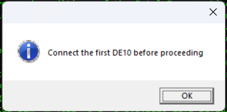
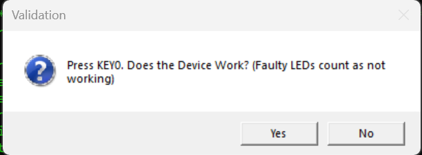
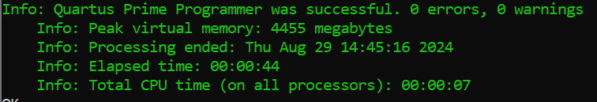
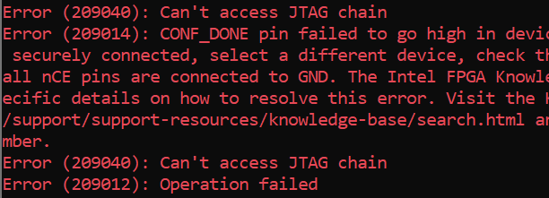
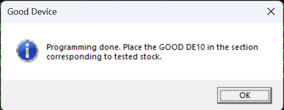
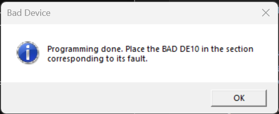
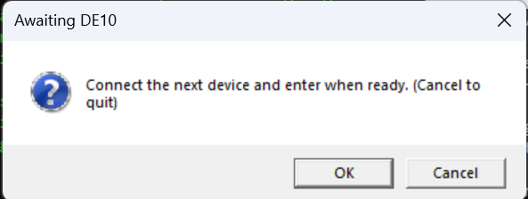

DE10_Lite QC workflow

All programming can also be done manually using the Quartus Programmer, but I will provide instructions assuming the use of the Powershell script

1. To run the script, simply navigate *In PowerShell* to QC_DE10 and run powershell_qc.ps1:

For each DE10_Lite, we need to first program it with DE10_LITE_Default.sof. This is the program we use to verify functionality of programming and the LEDs. Because it is a .sof file, it will not persist after the device is disconnected.

2. Press OK or enter once the first DE10 is connected to program it with DE10_LITE_Default.sof. 

3. Once programing has completed, a new dialog will pop up. Ensure the programming was successful (by examining the device and PowerShell output) and that the LEDs are all good (By pressing KEY0, the button closest to the VGA port)

4. Select the appropriate option

    If the device works, select 'Yes' to program the device with safe.pof. This is the program that sets all pins to pull-up and displays 3701 on the 7 segment displays.

    If the device does not work *in any way*, select 'No' to program the device with DE10_LITE_Default.pof. This is the test program, so it will be easy to see the device's fault.

    At the moment, the program does not check if programming completed successfully. You can verify it by checking the output of quartus_pgm.exe in PowerShell
   
    
    

6. Wait for the programming to complete. It will take a while because we are flashng a .pof (About 45 seconds for me). Once done, place the DE10 in the appropriate tested pile (e.g. Good, Bad_LEDs, Bad_JTAG) and press OK.
   

7. The program is now ready for the next board. Either connect another board and select OK to program the connected board with DE10_LITE_Default.sof or select Cancel to abort. 

8. Continue from Step 3

